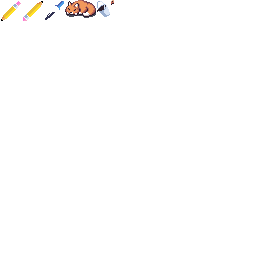

<p align="center">  
  
  <h3 align=center></h3>
</p>

# 
**Pixi** is an cross-platform open-source pixel art editor and animation editor written in Zig.


# 
## Features
- Typical pixel art operations. (draw, erase, color select, fill etc.)
- Create animations and preview easily, edit directly on the preview.
- View previous and next frames of the animation and edit directly.
- Set sprite origins for drawing sprites easily in game frameworks.
- Import and slice existing .png spritesheets.
- Intuitive and customizeable user interface.

## User Interface
- The user interface is driven by [Dear Imgui](https://github.com/ocornut/imgui) which should be familiar to many.

## Planned Features
- Sprite packing
- Export/import options.
    - Possibly .pyxel and .asesprite import
    - Export to .zig to directly use in Zig frameworks
    - .gif support
- Palettes
- Tiles 
- Possibly much more

## Compilation
- Download the latest Zig master from [here](https://ziglang.org/download/) and add to PATH.
- Clone pixi.
- Build.
    - ```git clone https://github.com/foxnne/pixi.git --recursive```
    - ```cd pixi```
    - ```zig build run```


## Credits
- The wonderful [Dear Imgui](https://github.com/ocornut/imgui) used for almost all of the user interface.
- [prime31](https://github.com/prime31) for all the help and for [zig-upaya](https://github.com/prime31/zig-upaya) which does most of the heavy lifting.
- All dependencies of zig-upaya such as [sokol](https://github.com/floooh/sokol), [tinyfiledialogs](https://sourceforge.net/projects/tinyfiledialogs/), [zip](https://github.com/kuba--/zip), [stb](https://github.com/nothings/stb) and [cimgui](https://github.com/cimgui/cimgui).
- Any and all contributors


     


